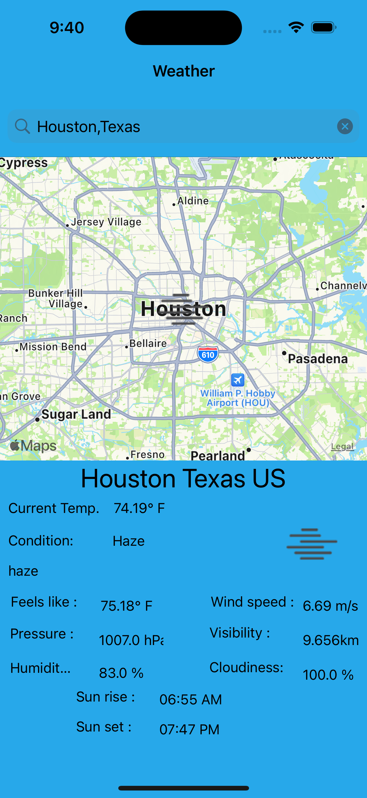
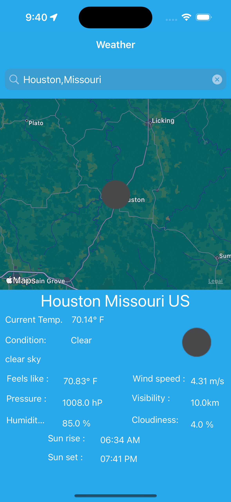

# Weather

## Description

Weather iPhone app is developed using Swift in MVVM architecture with Simple UI.

## Features

* When App launched for the first time, ask for user permission to get current location weather status.
* With user accepts displays current location details like city name, state name, sun rise, sun set times, temparature, cloudy or sunny i    mage for respective weather status etc...
* User can also see for any city weather status based on Search with city name.
* User can see last searched location details when app reopened.
* Display Alert for invalid city or state name.
* App supports light and dark mode.

** App Screens **

|||
|:----------------------------:|:------------------------:|
|Light Mode| Dark Mode |

**Flow :**

||
|:----------------------------:|
|Flow| 

# Installing

Run the app using XCode 13

## Api Source

- [Weather] - https://api.openweathermap.org/data/2.5/weather
- [Location] - https://api.openweathermap.org/geo/1.0/direct
- [Icon Image] - https://openweathermap.org/img/wn
- [Reverse Geo] - https://api.openweathermap.org/geo/1.0/reverse
